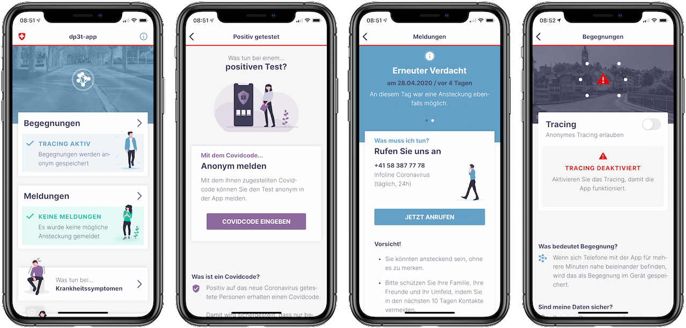

# Swiss PT – DP3T iOS App Switzerland

## DP3T
The Decentralised Privacy-Preserving Proximity Tracing (DP-3T) project is an open protocol for COVID-19 proximity tracing using Bluetooth Low Energy functionality on mobile devices that ensures personal data and computation stays entirely on an individual's phone. It was produced by a core team of over 25 scientists and academic researchers from across Europe. It has also been scrutinized and improved by the wider community.

DP-3T is a free-standing effort started at EPFL and ETHZ that produced this protocol and that is implementing it in an open-sourced app and server.

## Introduction
This is a COVID-19 tracing client using the [DP3T iOS SDK](https://github.com/DP-3T/dp3t-sdk-ios). This project will be released as the official COVID-19 tracing solution for Switzerland, therefore UX, messages and flows are optimized for this specific case. Nevertheless, the source code should be a solid foundation to build a similar app for other countries and demostrate how the SDK can be used in a real app. The app design, UX and implementation was done by [Ubique](https://www.ubique.ch?app=github).

## Contribution Guide

This project is truly open-source and we welcome any feedback on the code regarding both the implementation and security aspects.

Bugs or potential problems should be reported using Github issues. We welcome all pull requests that improve the quality the source code. 

Please note that the app will be available with approved translations in English, German, French, Italian, Romansh, Albanian, Bosnian, Croatian, Portuguese, Serbian and Spanish. Pull requests for additional translations currently won't be merged.

Platform independent UX and design discussions should be reported in [dp3t-ux-screenflows-ch](https://github.com/DP-3T/dp3t-ux-screenflows-ch)

## Repositories
* Android SDK & Calibration app: [dp3t-sdk-android](https://github.com/DP-3T/dp3t-sdk-android)
* iOS SDK & Calibration app: [dp3t-sdk-ios](https://github.com/DP-3T/dp3t-sdk-ios)
* Android App: [dp3t-app-android-ch](https://github.com/DP-3T/dp3t-app-android-ch)
* iOS App: [dp3t-app-ios-ch](https://github.com/DP-3T/dp3t-app-ios-ch)
* Backend SDK: [dp3t-sdk-backend](https://github.com/DP-3T/dp3t-sdk-backend)
* UX & Screenflows
[dp3t-ux-screenflows-ch](https://github.com/DP-3T/dp3t-ux-screenflows-ch)

## Further Documentation
The full set of documents for DP3T is at https://github.com/DP-3T/documents. Please refer to the technical documents and whitepapers for a description of the implementation.

A description of the usage of the Apple Exposure Notifcation API can be found [here](https://github.com/DP-3T/dp3t-sdk-ios/blob/master/EXPOSURE_NOTIFICATION_API_USAGE.md).

## Installation and Building

The project should be opened with the latest Xcode versions, 11.5. Dependencies are managed with [Swift Package Manager](https://swift.org/package-manager), no further setup is needed.

### Provisioning

The project is configured for a specific provisioning profile. To install the app on your own device, you will have to update the settings using your own provisioning profile.

Apples Exposure Notification Framework requires a  `com.apple.developer.exposure-notification` entitlement that will only be available to government entities. You will find more information in the [Exposure Notification Addendum](https://developer.apple.com/contact/request/download/Exposure_Notification_Addendum.pdf) and you can request the entitlement  [here](https://developer.apple.com/contact/request/exposure-notification-entitlement).

## Known issues

- [iOS 13.5 Background Task not always triggered consistently](https://github.com/DP-3T/dp3t-app-ios-ch/issues/163)
- [IEN11 and Insufficient Memory popup](https://github.com/DP-3T/dp3t-app-ios-ch/issues/162)
- [Exposure Notification Region Changed](https://github.com/DP-3T/dp3t-app-ios-ch/issues/127)

## License
This project is licensed under the terms of the MPL 2 license. See the [LICENSE](LICENSE) file.
